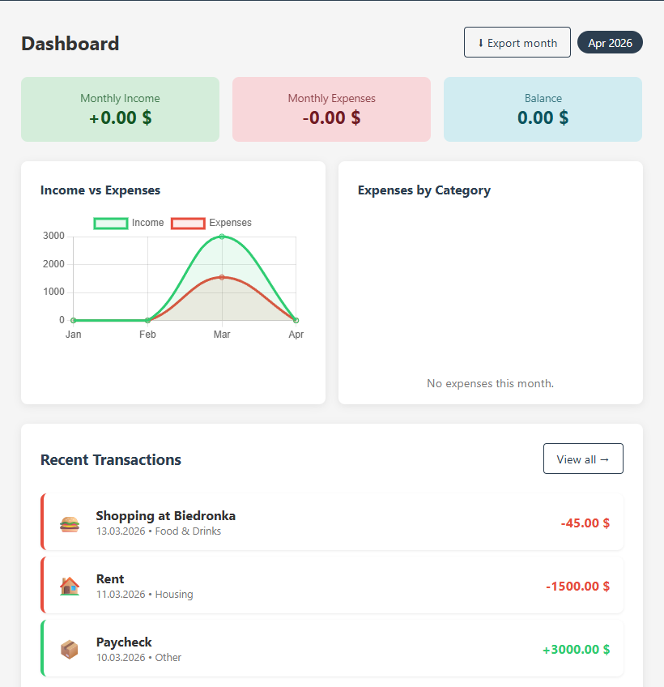
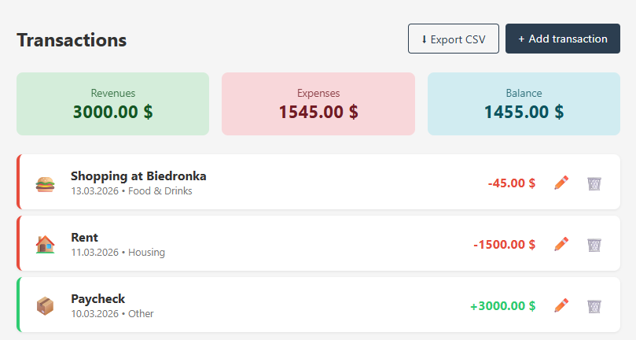
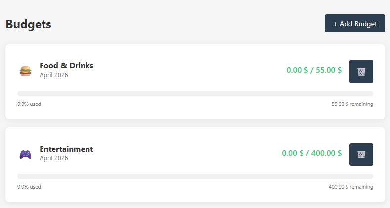

# 💰 Moneta — Personal Finance Tracker

A full-stack web application for tracking personal finances, built with Flask and vanilla JavaScript.



## ✨ Features

- **User Authentication** — secure registration and login with password hashing
- **Transaction Tracking** — add, edit, and delete income and expense transactions
- **Budget Management** — set monthly spending limits per category with visual progress bars
- **Interactive Dashboard** — charts showing income vs expenses and spending by category
- **CSV Export** — export transactions to CSV for use in Excel or Google Sheets
- **Category System** — 8 default categories with icons and colors

## 🛠️ Tech Stack

**Backend:**
- Python 3.11
- Flask — web framework
- Flask-SQLAlchemy — ORM for database management
- Flask-Login — user session management
- SQLite (development) / PostgreSQL (production-ready)

**Frontend:**
- HTML5 + CSS3
- Vanilla JavaScript
- Chart.js — interactive charts

## 🚀 Getting Started

### Prerequisites
- Python 3.11+
- Git

### Installation

1. Clone the repository
```bash
git clone https://github.com/YOUR_USERNAME/moneta.git
cd moneta
```

2. Create and activate virtual environment
```bash
python -m venv venv

# Windows
venv\Scripts\activate

# Mac/Linux
source venv/bin/activate
```

3. Install dependencies
```bash
pip install -r requirements.txt
```

4. Run the application
```bash
python run.py
```

5. Open your browser and go to `http://127.0.0.1:5000`

> The database and default categories are created automatically on first run.

## 📁 Project Structure
```
moneta/
├── app/
│   ├── __init__.py        # App factory, extensions
│   ├── models.py          # Database models
│   ├── routes.py          # Dashboard routes
│   ├── auth.py            # Authentication (register, login, logout)
│   ├── transactions.py    # Transaction CRUD
│   ├── budgets.py         # Budget management
│   ├── exports.py         # CSV export
│   ├── templates/         # Jinja2 HTML templates
│   └── static/            # CSS and JS files
├── config.py              # App configuration
├── run.py                 # Entry point
└── requirements.txt       # Python dependencies
```

## 📸 Screenshots

### Dashboard


### Transactions


### Budgets


## 🔒 Security Features

- Passwords are hashed using Werkzeug's `generate_password_hash`
- Users can only access their own data
- Session management via Flask-Login
- Protection against accessing other users' resources

## 📄 License

This project is open source and available under the [MIT License](LICENSE).

---

## 🤖 Narzędzia i wsparcie

Projekt został zbudowany przy pomocy [Claude](https://claude.ai) — asystenta AI, który wspierał proces planowania architektury, pisania kodu oraz rozwiązywania problemów technicznych napotkanych podczas rozwoju projektu.